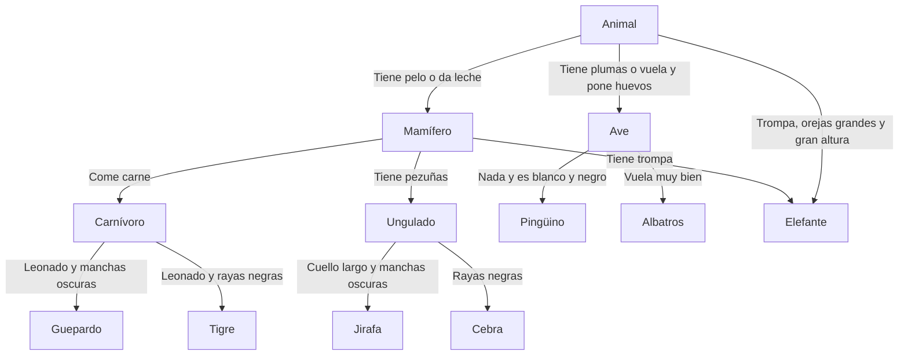

# Ontología de animales

## Jerarquía de animales

```mermaid
flowchart TD
    A["Animal"]

    A -->|Tiene pelo o da leche| M["Mamífero"]
    A -->|Tiene plumas o vuela y pone huevos| V["Ave"]

    M -->|Come carne| C["Carnívoro"]
    M -->|Tiene pezuñas| U["Ungulado"]

    C -->|Leonado y manchas oscuras| G["Guepardo"]
    C -->|Leonado y rayas negras| T["Tigre"]

    U -->|Cuello largo y manchas oscuras| J["Jirafa"]
    U -->|Rayas negras| Z["Cebra"]

    V -->|Nada y es blanco y negro| P["Pingüino"]
    V -->|Vuela muy bien| AL["Albatros"]

    M -->|Tiene trompa| E["Elefante"]
    A -->|Trompa, orejas grandes y gran altura| E
```

